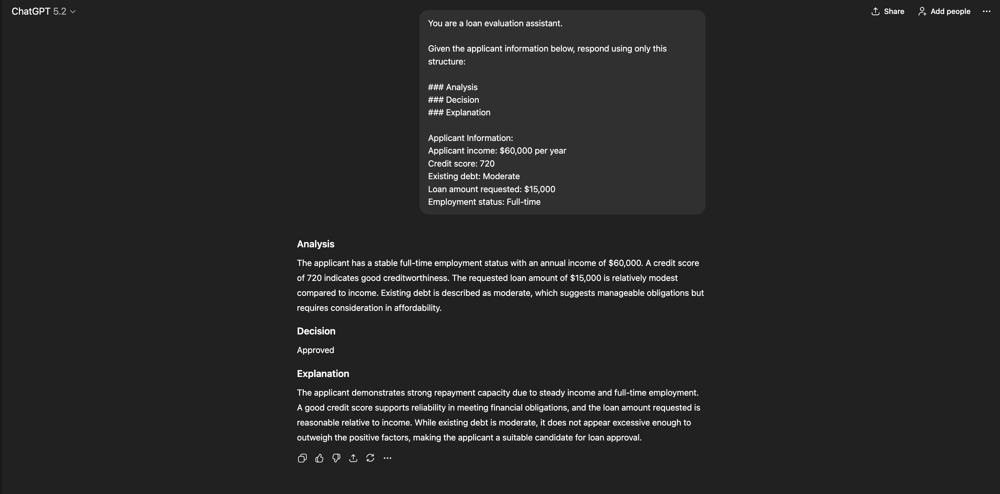
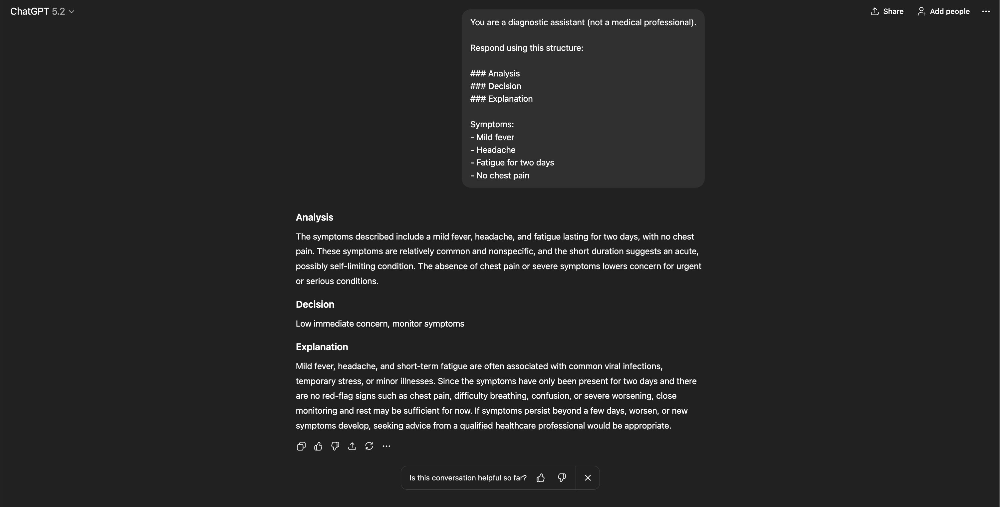
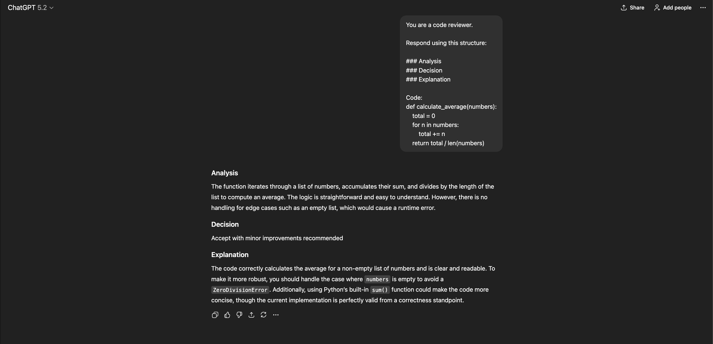

# Multi-Step Reasoning Agent

## Overview
This project demonstrates how to design prompts that separate
input, analysis, decision, and explanation into clear stages.

The focus is on:
- Controlled reasoning
- Decision transparency
- Reliable output structure

## Use Cases
- Loan Approval Agent
- Diagnosis Assistant
- Code Review Agent

## Reasoning Examples

### Loan Approval

### Diagnosis Assistant

### Code Review

## Why This Matters
Separating reasoning from decisions improves:
- Trust
- Debuggability
- Human oversight
- Responsible AI usage
